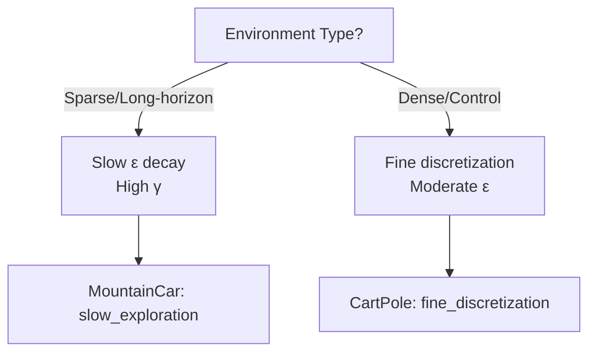

# RL Hyperparameter Showdown: MountainCar vs CartPole 

**Comprehensive comparison of Q-Learning hyperparameters across two classic Gymnasium environments**

This repository contains two sister projects that systematically test Q-Learning configurations to reveal how **hyperparameters dramatically change performance** based on environment characteristics.

## What I'm Achieving

**Core Question**: *Why do the same hyperparameters fail spectacularly in one environment but excel in another?*

**Methodology**:
- Identical Q-Learning implementation
- Same 7 configurations tested
- 10,000 episodes per experiment
- Rich visualization + logging
- **Cross-environment comparison**

**Key Insight**: **No universal "best" hyperparameters** — success depends on environment dynamics!

## Environment Showdown

| Feature | **MountainCar-v0** | **CartPole-v1** |
|---------|----------------------|-------------------|
| **Reward Structure** | -1/step, sparse (goal only) | +1/step, dense |
| **Success Metric** | Reach flag (~110 steps) | Balance 500 steps |
| **State Space** | 2D continuous | 4D continuous |
| **Core Challenge** | **Exploration** + momentum | **Precision** control |
| **Planning Horizon** | Long-term (swing strategy) | Short-term corrections |

## Winners & Losers

| Config | **MountainCar** | **CartPole** | **Why?** |
|--------|-------------------|----------------|----------|
| `slow_exploration` | **-146.8** | ~248.3 | Long exploration = momentum building |
| `fine_discretization` | ~164.7 | **258.0** | Precision = better control |
| `baseline` | ~177.6 | ~160.1 | Works okay everywhere |
| `high_discount` | ~160.7 | - | Values future rewards |
| `fast_exploration` | ~189.7 | ~157.4 | Locks into bad policies |
| `high_learning_rate` | ~196.8 | **13.2** | Unstable everywhere |
| `low_discount` | **~199.6** | ~144.0 | Ignores future rewards |

## Deep Insights

### 1. **Exploration Speed Kills MountainCar**

MountainCar needs: LEFT → momentum → RIGHT
fast_exploration: "Exploits early" → stuck
slow_exploration: "Explores long enough" → learns swing

### 2. **Precision Wins CartPole**

CartPole needs: tiny corrections every step
coarse buckets: "Misses small angle changes"
fine_discretization: "Sees subtle deviations" → 500-step mastery


### 3. **Learning Rate Trap**

α = 0.5 destroys both environments:

Overshoots optimal Q-values

Creates instability oscillations

Reward collapse inevitable

## Hyperparameter Decision Tree



### Repository Structure

```
Reinforcement Learning/
├── README.md                 ← This file
├── mountaincar_qlearning/
│   ├── README.md            ← Detailed MountainCar analysis
│   ├── mountaincar_qlearning.py
│   └── experiments/
└── cartpole_qlearning/
    ├── README.md            ← Detailed CartPole analysis
    ├── cartpole_qlearning.py
    └── experiments/
```
---
## All Results Heatmap

| Config | 🏔️ **MountainCar**<br/>(↑ better) | 🎯 **CartPole**<br/>(↑ better) | **Robustness** |
|--------|----------------------------------|-------------------------------|---------------|
| `slow_exploration` | **-146.8** 🥇 | **248.3** 🥈 | ⭐⭐⭐⭐⭐ |
| `fine_discretization` | -164.7 🥈 | **258.0** 🥇 | ⭐⭐⭐⭐ |
| `baseline` | -177.6 | 160.1 | ⭐⭐⭐ |
| `high_discount` | -160.7 🥉 | - | ⭐⭐⭐ |
| `fast_exploration` | -189.7 | 157.4 | ⭐⭐ |
| `high_learning_rate` | -196.8 | **13.2** | ⭐ |
| `low_discount` | **-199.6** | 144.0 | ⭐ |

## How to Make It Even Better
### Immediate Improvements
✅ Add DQN (neural Q-learning) baseline

✅ Test different bucket strategies

✅ Include Double Q-Learning

✅ Add SARSA comparison

✅ Hyperparameter optimization (Optuna)

### Future Extensions
🔄 Continuous action spaces (PPO/DQN)

🔄 Multi-agent scenarios

🔄 Transfer learning between envs

🔄 Real-world robotics deployment

### Takeaways for Your RL Journey
Test systematically — don't guess hyperparameters

Understand environment dynamics — sparse vs dense rewards

Visualize everything — curves reveal hidden behaviors

Never use α > 0.1 — stability first

Match exploration to problem — slow for sparse, moderate for control