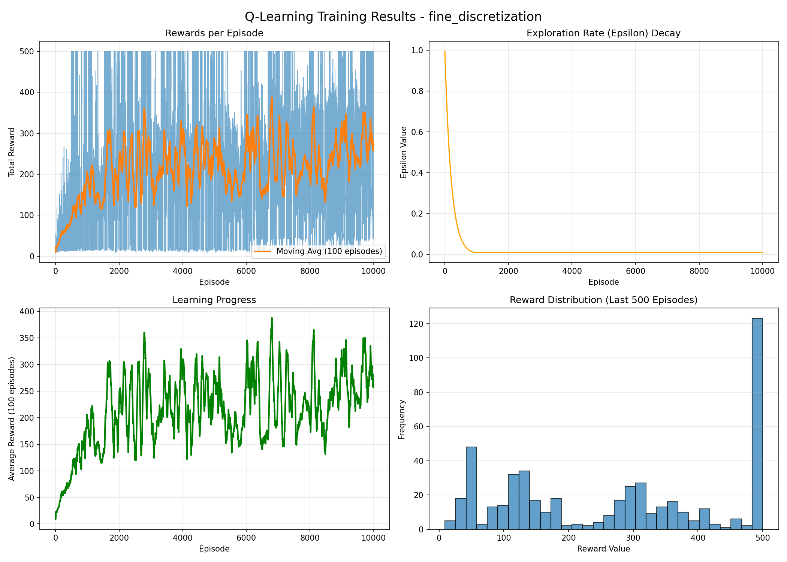
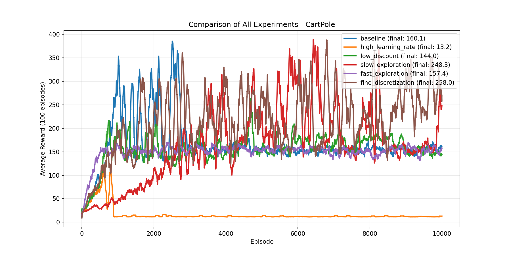
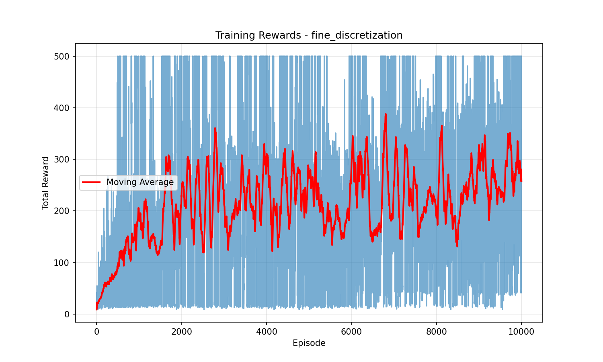

# CartPole Q-Learning Experiments

This project implements and compares multiple Q-Learning configurations on the **CartPole-v1** environment using Gymnasium.

**Goal**: Analyze how learning rate, discount factor, exploration strategy, and state discretization affect performance in a classic control RL problem.

*CartPole-v1: Balance the pole by pushing cart left/right*

## Environment Specs

| Feature | Details |
|---------|---------|
| **Environment** | CartPole-v1 |
| **State Space** | Continuous (4D): • Cart position • Cart velocity • Pole angle • Pole angular velocity |
| **Action Space** | Discrete (2 actions: Left/Right) |
| **Reward** | +1 per timestep pole stays upright |
| **Max Reward** | 500 per episode |

**Key Challenge**: Precise corrective actions to maintain balance.

## Approach

- Tabular Q-Learning with discretized state space
- Epsilon-greedy exploration
- Fixed budget: 10,000 episodes
- Moving average (100 episodes)

**Tracked Metrics**:
- Reward per episode
- Moving average reward
- Exploration rate (epsilon)
- Reward distribution (last 500 episodes)

## Experiments Tested

| Experiment | Key Change |
|------------|------------|
| `baseline` | Default parameters |
| `high_learning_rate` | Learning rate α = 0.5 |
| `low_discount` | Discount factor γ = 0.8 |
| `slow_exploration` | Slower epsilon decay (0.999) |
| `fast_exploration` | Faster epsilon decay (0.99) |
| `fine_discretization` | Finer buckets (5×5×10×10) |

---

## BEST PERFORMER: `fine_discretization`

*All experiments - higher reward = better balance*

| Experiment | Final Avg Reward |
|------------|------------------|
| `fine_discretization` | **~258.0** (BEST) |
| `slow_exploration` | ~248.3 |
| `baseline` | ~160.1 |
| `fast_exploration` | ~157.4 |
| `low_discount` | ~144.0 |
| `high_learning_rate` | ~13.2 ❌ |

**Higher reward = pole balanced longer = better policy**

## Detailed Analysis

### Overall Comparison

**Key Observations**:
- `fine_discretization` dominates late training
- `slow_exploration` shows consistent gains
- Others plateau early or collapse

**CartPole rewards PRECISION — finer discretization captures subtle state changes**

### Why `fine_discretization` Wins 🥇

| Metric | Performance |
|--------|-------------|
| **Rewards** | Frequent 500-step episodes |
| **Learning** | Continues improving late |
| **Distribution** | Heavy 300-500 cluster |
| **Epsilon** | Balanced exploration/exploitation |

### Why Others Fail

| Config | Problem |
|--------|---------|
| `high_learning_rate` | Q-values overshoot → collapse |
| `baseline` | Coarse discretization → plateaus |
| `fast_exploration` | Locks into suboptimal policy |

## Key RL Insight

**CartPole is CONTROL, not long-term planning**:

DETECT small state deviations

REACT immediately

MAINTAIN equilibrium

text

**Perfect config**: Fine discretization + moderate exploration

## 📁 Output Files (Per Experiment)

cartpole/
├── fine_discretization/
│ ├── q_table.npy
│ ├── training_overview_fine_discretization.png
│ ├── training_rewards_fine_discretization.png
│ ├── epsilon_decay_fine_discretization.png
│ └── training_log_fine_discretization.txt