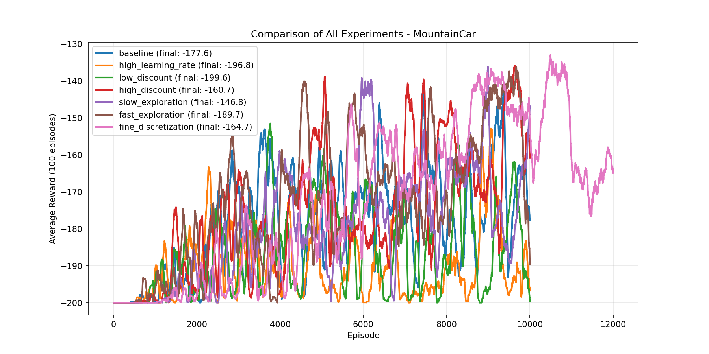
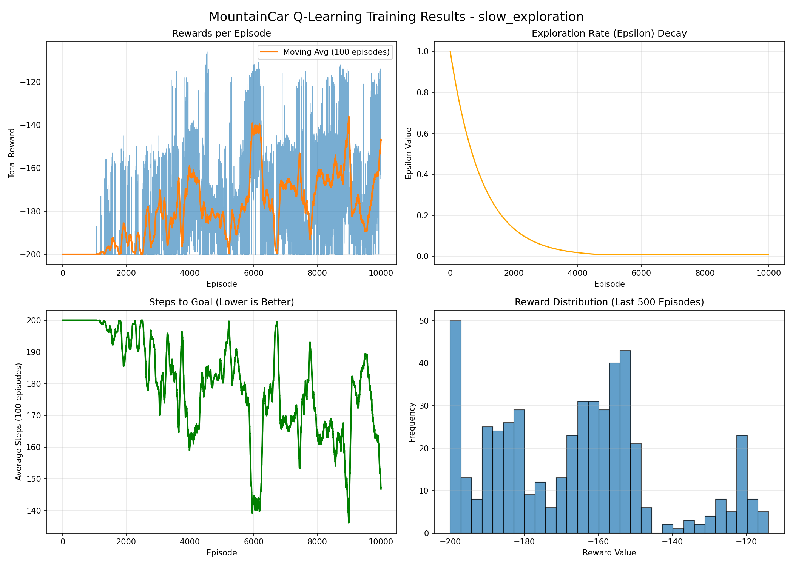
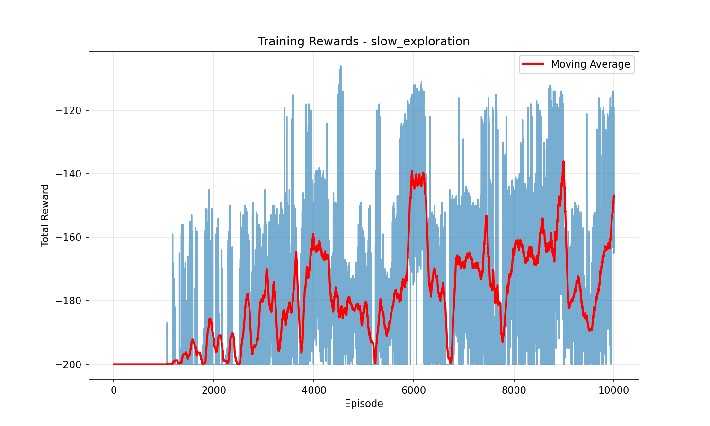

# MountainCar Q-Learning Experiments

This project implements and compares multiple Q-Learning configurations on the **MountainCar-v0** environment using Gymnasium.

**Goal**: Understand how hyperparameters affect learning in a sparse-reward, long-term planning RL problem.

*MountainCar-v0: Agent must swing left to build momentum before climbing right*

## Environment Specs

| Feature | Details |
|---------|---------|
| **Environment** | MountainCar-v0 |
| **State Space** | Continuous (position, velocity) |
| **Action Space** | Discrete (3 actions: left, no-op, right) |
| **Reward** | -1 per timestep until goal |

**Key Challenge**: Agent must move *away* from goal initially to build momentum.

## Approach

- Q-Learning with discretized state space
- Epsilon-greedy exploration
- Moving average evaluation (100 episodes)
- Detailed logging & visualization

**Tracked Metrics**:
- Total reward per episode
- Moving average reward
- Exploration rate (epsilon)
- Steps to reach goal
- Reward distribution (last 500 episodes)

## Experiments Tested

| Experiment | Key Change |
|------------|------------|
| `baseline` | Default parameters |
| `high_learning_rate` | Learning rate α = 0.5 |
| `low_discount` | Discount factor γ = 0.8 |
| `high_discount` | Discount factor γ = 0.999 |
| `fast_exploration` | Faster epsilon decay (0.99) |
| `slow_exploration` | Slower epsilon decay (0.999) |
| `fine_discretization` | Finer state buckets (30×30) |

---

## BEST PERFORMER: `slow_exploration`

*All experiments - higher (less negative) = better*

| Experiment | Final Avg Reward |
|------------|------------------|
| `slow_exploration` | **~ -146.8** |
| `high_discount` | ~ -160.7 |
| `fine_discretization` | ~ -164.7 |
| `baseline` | ~ -177.6 |
| `fast_exploration` | ~ -189.7 |
| `high_learning_rate` | ~ -196.8 |
| `low_discount` | ~ -199.6 |

**Less negative = fewer steps = better policy**

## Detailed Analysis

### Overall Comparison

**Key Observations**:
- `slow_exploration` stays consistently above others
- Less collapse after initial learning
- Others either learn too fast → collapse, or never learn long-term behavior

**MountainCar needs patience — slow exploration provides it**

### Why `slow_exploration` Wins

| Metric | Performance |
|--------|-------------|
| **Rewards** | Smooth upward trend, fewer drops |
| **Steps to Goal** | ~140-150 steps (much improved) |
| **Reward Distribution** | Strong cluster -160 to -145 |
| **Epsilon Decay** | Longer exploration phase |

### Why Others Fail

| Config | Problem |
|--------|---------|
| `fast_exploration` | Exploits before understanding momentum |
| `low_discount` | Ignores delayed rewards |
| `high_learning_rate` | Q-values overshoot → unstable |

## Key RL Insight

**MountainCar is about RHYTHM, not speed**:

Move LEFT first (bad short-term reward)

Build MOMENTUM

Climb RIGHT (delayed reward)

text

**Perfect config**: Slow exploration + high discount factor

## Output Files (Per Experiment)

experiments/
├── slow_exploration/
│ ├── q_table.npy
│ ├── training_overview_slow_exploration.png
│ ├── training_rewards_slow_exploration.png
│ ├── epsilon_decay_slow_exploration.png
│ └── training_log_slow_exploration.txt